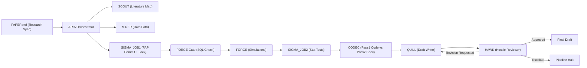

# Paper-Forge

Autonomous finance-research pipeline that runs a full paper workflow with protocol gates:

- literature discovery
- data + simulation execution
- statistical battery
- code/spec consistency audit
- paper drafting
- hostile review loop

## Why This Exists

Paper-Forge is built to reduce the gap between:

1. research specification (`PAPER.md`)
2. executed analysis artifacts
3. manuscript claims

The system enforces phase ordering, records run-state in SQLite, and uses explicit review gates before acceptance.

## Architecture



## Phase Protocol

Fixed order:

`SCOUT → MINER → SIGMA_JOB1 → FORGE → SIGMA_JOB2 → CODEC → QUILL → HAWK`

Key enforcement points:

- FORGE can start only if `pap_lock.locked_at IS NOT NULL AND forge_started_at IS NULL`
- CODEC runs two isolated passes (code-only, spec-only)
- QUILL output passes quality gates (references, evidence density, visuals)
- HAWK can request revisions; ARIA cycles QUILL ↔ HAWK before final decision

## Core Directories

- `agents/` agent implementations
- `paper_memory/<run_id>/` run artifacts (drafts, reviews, stats tables, audit files)
- `outputs/` simulation and analysis outputs
- `tests/` pipeline and hardening tests
- `state.db` pipeline state and phase ledger

## Database Tables (Runtime)

- `pipeline_runs`
- `phases`
- `pap`
- `pap_lock`
- `artifacts`
- `agent_results`
- `server_health_log`
- `checkpoints`

## Quick Start

### 1) Environment

```bash
python -m venv .venv
source .venv/bin/activate
pip install -r requirements.txt
```

### 2) Tests

```bash
pytest -q
```

### 3) Run Pipeline (End-to-End)

```bash
export PAPER_FORGE_MINER_SOURCE=yfinance
python run_aria_pipeline.py
```

This writes a new run under `paper_memory/pf-live-YYYYMMDD-HHMMSS/`.

## Typical Outputs Per Run

- `literature_map.md`
- `codec_spec.md`
- `codec_pass2.md`
- `codec_mismatch.md`
- `stats_tables/*.csv`
- `paper_draft_v*.tex`
- `hawk_scores_v*.json`
- `hawk_review_v*.md`

## Review Workflow

1. Run ARIA end-to-end.
2. Inspect `hawk_review_v*.md` for actionable issues.
3. Regenerate draft revisions via ARIA cycle.
4. Compile latest draft to PDF:

```bash
cd paper_memory/<run_id>
pdflatex paper_draft_vN.tex
pdflatex paper_draft_vN.tex
```

## Notes

- External APIs can rate-limit (SCOUT has retry/fallback behavior).
- WRDS-first policy is enforced by design; controlled fallback can be set by env.
- Use run-specific artifact folders for traceability and audits.

