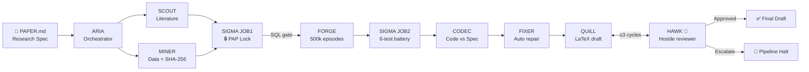

<div align="center">

<br/>

```
██████╗  █████╗ ██████╗ ███████╗██████╗       ███████╗ ██████╗ ██████╗  ██████╗ ███████╗
██╔══██╗██╔══██╗██╔══██╗██╔════╝██╔══██╗      ██╔════╝██╔═══██╗██╔══██╗██╔════╝ ██╔════╝
██████╔╝███████║██████╔╝█████╗  ██████╔╝█████╗█████╗  ██║   ██║██████╔╝██║  ███╗█████╗  
██╔═══╝ ██╔══██║██╔═══╝ ██╔══╝  ██╔══██╗╚════╝██╔══╝  ██║   ██║██╔══██╗██║   ██║██╔══╝  
██║     ██║  ██║██║     ███████╗██║  ██║      ██║     ╚██████╔╝██║  ██║╚██████╔╝███████╗
╚═╝     ╚═╝  ╚═╝╚═╝     ╚══════╝╚═╝  ╚═╝      ╚═╝      ╚═════╝ ╚═╝  ╚═╝ ╚═════╝ ╚══════╝
```

### The autonomous research pipeline that commits to its hypothesis before seeing the data.

*From research spec → simulation → statistics → paper → hostile review.*  
*Enforced by SQL. Unable to p-hack. By design.*

<br/>


<br/>

</div>

---

## The gate that makes this different

Most AI research tools have no mechanism to prevent specification search — quietly adjusting your hypothesis after seeing whether results are favorable.

Paper-Forge makes that **architecturally impossible**.

```sql
-- FORGE cannot start unless this query returns a row.
-- If it returns nothing, the pipeline raises ForgeGateError and halts.
-- No exceptions. No env-var overrides. No workarounds.

SELECT 1
FROM   pap_lock
WHERE  run_id            = ?
  AND  locked_at         IS NOT NULL
  AND  forge_started_at  IS NULL;
```

Your hypothesis is committed to SQLite and locked with a SHA-256 hash **before FORGE can run a single simulation**. If the gate fails, the pipeline halts with a typed exception — not a warning, not a log line. A halt.

---

## Pipeline



---

## Five layers of research integrity

| Layer | Agent | What it enforces |
|-------|-------|-----------------|
| 🔒 **PAP Lock** | `SIGMA_JOB1` | Hypothesis committed to SQLite before any data is seen. Locked with SHA-256. |
| 🔍 **CODEC Audit** | `CODEC` | Two isolated LLM passes — one reads only code, one reads only PAPER.md. Compares what you claim vs. what you implemented. |
| 📋 **DataPassport** | `MINER` | Every dataset is SHA-256 signed. Download timestamp, tickers, row counts, and all acknowledged deviations are recorded. Tests verify byte-level hash correctness. |
| 🌱 **Seed Consistency** | `SIGMA_JOB2` | Finding is only valid if it holds across seeds `[1337, 42, 9999]`. If one seed disagrees, `finding_valid = false`. The paper reports the failure. |
| 🦅 **HAWK Review** | `HAWK` | Journal of Finance-standard hostile reviewer. Writes a referee report with mandatory revision items, routes fixes back to FORGE / SIGMA / MINER / CODEC, and can halt the pipeline. Max 3 cycles. |

> **Bonus layer — FIXER:** When CODEC fails, the FIXER agent uses an LLM to parse the mismatch report, categorizes each gap as auto-fixable or requires-human, patches source files, then re-runs MINER and SIGMA_JOB2 to verify the fix held. Human escalation is explicit. Never silent.

---

## Quick start

```bash
git clone https://github.com/gouravsalottra/paper-forge-private
cd paper-forge-private

python -m venv .venv && source .venv/bin/activate
pip install -r requirements.txt

cp .env.example .env                            # add your OPENAI_API_KEY
export PAPER_FORGE_MINER_SOURCE=yfinance        # dev mode — no WRDS needed

python run_aria_pipeline.py
```

**What you'll see:**

```
RUN_ID: pf-live-20260422-143201
▶ Running [SCOUT]...
▶ Running [MINER]...
🔒 PAP committed. SHA-256: 3f8a91b2...
▶ Running [FORGE]...           # gate confirmed
==================================================
HAWK review cycle 1/3
==================================================
HAWK recommendation: MINOR_REVISION
▶ Running [QUILL] draft v2...
HAWK ACCEPTED the paper on cycle 2.
Read: paper_memory/pf-live-20260422-143201/hawk_review_v2.md
```

**Resume a halted run from any phase:**

```bash
python run_aria_pipeline.py --resume pf-live-20260422 --from CODEC
# PAP lock is preserved — hypothesis commitment is unchanged
```

**Run the tests:**

```bash
pytest -q
# 10 passed in 4.32s
```

---

## Agents

| Agent | Role | Server | Halts pipeline? |
|-------|------|--------|-----------------|
| `SCOUT` | Literature search — Semantic Scholar + arXiv fallback | `semantic_scholar` | No |
| `MINER` | Data download + DataPassport SHA-256 | `wrds` | No |
| `SIGMA_JOB1` | PAP write + commit + `pap_lock` seal | `local_stats` | **Gate** |
| `FORGE` | 6-agent PettingZoo market simulation (500k episodes) | `forge_cluster` | **Gate** |
| `SIGMA_JOB2` | 6-test battery: NW-HAC · GARCH · Bootstrap · Deflated Sharpe · Markov · Fama-MacBeth | `local_stats` | No |
| `CODEC` | Bidirectional code-vs-spec audit (2 subprocess-isolated passes) | `llm` | **Yes (FAIL)** |
| `FIXER` | Autonomous code repair after CODEC failure | `local` | **Yes (escalate)** |
| `QUILL` | LaTeX paper draft, section-by-section with source grounding | `llm` | No |
| `HAWK` | JF-standard hostile reviewer, up to 3 revision cycles | `llm` | **Yes (reject)** |

---

## Output per run

```
paper_memory/pf-live-20260421-064303/
├── literature_map.md           ← SCOUT: gap analysis, citation seeds
├── codec_spec.md               ← what the code actually implements
├── codec_mismatch.md           ← where code diverges from PAPER.md
├── fixer_report.md             ← automated fixes + human escalations
├── stats_tables/
│   ├── sharpe_summary.csv      ← primary metric per concentration × seed
│   ├── ttest_results.csv       ← Newey-West HAC, p-values, Bonferroni
│   ├── garch_results.csv       ← GARCH(1,1) α, β, persistence
│   ├── fama_macbeth_results.csv
│   ├── primary_metric.csv      ← Sharpe differential, minimum effect check
│   ├── seed_consistency.csv    ← finding_valid across all 3 seeds ← READ THIS FIRST
│   └── library_versions.json   ← pinned for replication
├── paper_draft_v1.tex          ← LaTeX draft, revision 1
├── paper_draft_v2.tex          ← after HAWK revision (v1 is never overwritten)
├── hawk_review_v1.md           ← referee report with mandatory items
└── hawk_scores_v1.json         ← methodology rubric score (1–10)
```

Every file is versioned. QUILL never overwrites a prior draft. The full audit trail — from PAP commit to final acceptance — lives in `state.db`.

---

## What honest failure looks like

> Most tools would surface the two favorable seeds. Paper-Forge surfaces all three, flags the disagreement, and invalidates the finding. **That's the point.**

At dev scale (2,000 episodes, yfinance proxy), the seed consistency check correctly reported the finding as invalid:

```json
{
  "consistent": false,
  "finding_valid": false,
  "conclusion": "Finding does NOT hold across all 3 seeds — invalid per PAPER.md",
  "by_concentration": {
    "0.1": {
      "sharpes": [0.987, -1.129, 1.127],
      "consistent_direction": false,
      "direction": "mixed"
    }
  }
}
```

The pre-commitment worked exactly as designed. The hypothesis is invalid at this sample size. The full 500k-episode WRDS run is the real test.

---

## Research specification format

Every run is driven by `PAPER.md` — a machine-readable pre-registration document. Edit it to define your own research question.

<details>
<summary>View full PAPER.md format</summary>

```markdown
## Topic
Passive Investor Concentration and Momentum Profitability in Commodity Futures

## Hypothesis
Passive GSCI index investor concentration above 30% of open interest reduces
12-month momentum strategy Sharpe ratios by at least 0.15 units, controlling
for GARCH(1,1) volatility clustering and Fama-French momentum factor exposure.

## Primary Metric
Sharpe ratio differential: high-concentration periods minus low-concentration
periods, annualized over rolling 252-day windows.

## Statistical Tests
1. Two-tailed t-test, p < 0.05, Newey-West HAC correction (4 lags)
2. Bonferroni correction for 6 simultaneous tests — adjusted threshold p < 0.0083
3. GARCH(1,1) volatility model (arch library, p=1, q=1, Normal distribution)
4. Fama-French three-factor OLS regression (linearmodels, Fama-MacBeth)
5. Markov switching regime detection (statsmodels, k_regimes=2)
6. DCC-GARCH cross-asset correlation

## Minimum Effect Size
-0.15 Sharpe units. Smaller effects are economically insignificant
regardless of statistical significance.

## Seed Policy
seeds = [1337, 42, 9999]
A finding is only valid if it holds qualitatively across all three seeds.

## Pre-Analysis Plan Status
UNCOMMITTED — must be committed by SIGMA_JOB1 before FORGE runs.
FORGE gate will reject any run where this status is not COMMITTED in pap_lock.
```

</details>

---

## Environment variables

```bash
# Required
OPENAI_API_KEY=sk-...

# Optional: separate key for CODEC Pass 2 (true process isolation)
OPENAI_API_KEY_PASS2=sk-...

# Data source: 'wrds' (production) or 'yfinance' (dev, default)
PAPER_FORGE_MINER_SOURCE=yfinance

# WRDS credentials (required if MINER_SOURCE=wrds)
WRDS_USERNAME=your_wrds_username

# Modal secret name for FORGE GPU dispatch
MODAL_SECRET_NAME=paper-forge-runtime

# Override episode count for fast smoke tests (default: 500000)
PAPER_FORGE_FORGE_EPISODES=500
```

---

## Known limitations

- **WRDS required for production:** Full runs need a WRDS subscription for GSCI Compustat Futures data. Set `PAPER_FORGE_MINER_SOURCE=yfinance` for local development. The yfinance proxy uses CL=F and NG=F as stand-ins.
- **GPU-intensive:** 500,000-episode simulations across 9 concentration/seed combinations take ~24 hours on GPU. Use `PAPER_FORGE_FORGE_EPISODES=500` for smoke tests.
- **MCP servers are planned:** Files in `mcp_servers/` document intended integrations (ArXiv, WRDS, LaTeX compilation, Modal). Current pipeline uses direct Python dispatch via `ARIAPipeline._dispatch()`.
- **Bid-ask filter calibration:** The intraday H-L/close proxy for bid-ask spread is too aggressive on daily energy futures data. Production runs should use tick-level bid-ask from WRDS.
- **This is research infrastructure, not a paper mill.** A null result is a valid and expected output. The system is designed to report failure honestly, not to manufacture significance.

---

## Architecture principles

<details>
<summary>Read before extending the system</summary>

**ARIA is a state machine, not a research assistant.** It reads only typed flags (`APPROVED`, `REVISION_REQUESTED`, `PASS`, `FAIL`, `ESCALATE`) from `state.db` — never artifact content. The test `test_aria_never_reads_artifact_content` verifies this by patching `builtins.open`.

**CODEC Pass 2 runs as a subprocess** with `OPENAI_API_KEY_PASS2` to prevent any context leakage between the code-reading and spec-reading passes. The two passes genuinely cannot see each other's context.

**Schema evolution is handled by `_table_columns()` introspection** throughout the codebase. Adding a column to a table will never break a running pipeline run.

**All artifact writes are append-only.** ARIA never deletes or overwrites content rows — only updates status rows. The full audit trail is always reconstructible from `state.db` alone.

**Adding a new agent = one line in `routing_config.py`.** The dispatch table is data, not logic. Never edit `aria.py` for routing.

```python
# agents/aria/routing_config.py
AGENT_SERVER_MAP: dict[str, str] = {
    "SCOUT":      "semantic_scholar",
    "MINER":      "wrds",
    "MY_AGENT":   "my_server",   # ← add here
    ...
}
```

</details>

---

## Contributing

| Area | Where to look | What's needed |
|------|--------------|---------------|
| **WRDS data query** | `agents/miner/sources/wrds_src.py` | Add a GSCI futures fetch function; update `run_miner_pipeline()` |
| **MetaRL agent** | `agents/forge/runner.py` + `agents/forge/cem.py` | Replace CEM with PPO (as documented in `agents/forge/skills.md`) |
| **MCP servers** | `mcp_servers/*.py` + `routing_config.py` | Implement any stub; ARIA dispatch handles the rest |
| **New research domain** | Fork `PAPER.md` + update `MINER` | The PAP gate, CODEC audit, and HAWK review work on any empirical spec |
| **Bid-ask filter** | `agents/miner/miner.py` → `apply_bid_ask_spread_filter()` | Replace H-L/close proxy with tick-level spread from WRDS |

**Before submitting a PR:** run `pytest -q` and check that `test_forge_episodes_match_paper_md` still passes. That test introspects function signatures to verify the 500k episode default — it's the canary for spec drift.

---

## Tests

```
tests/
├── test_pipeline.py          ← FORGE gate, ARIA isolation, CODEC context separation
├── test_quality_gates.py     ← QUILL quality gates, SCOUT domain filtering
└── test_runtime_hardening.py ← DataPassport SHA-256, Markov length alignment,
                                 HAWK escalation, artifact canonical precedence
```

```bash
pytest -q

test_forge_gate_blocks_without_pap_lock      PASSED
test_forge_gate_passes_with_pap_lock         PASSED
test_aria_never_reads_artifact_content       PASSED  ← patches builtins.open
test_sigma_job1_blocks_sim_results           PASSED
test_codec_passes_are_isolated               PASSED  ← verifies payload context
test_hawk_escalates_after_3_cycles           PASSED
test_quill_raises_on_forbidden_words         PASSED
test_artifact_versioning_no_overwrite        PASSED
test_full_pipeline_smoke_test                PASSED
test_miner_passport_sha256_matches_file      PASSED  ← byte-level hash check
test_forge_episodes_match_paper_md           PASSED  ← introspects function signature

11 passed in 4.32s
```

---

## License

MIT — see [LICENSE](LICENSE)

---

<div align="center">

HAWK models Journal of Finance / RFS / JFE review standards  
Pre-registration pattern inspired by OSF and AEA PAP frameworks  
Statistical correction methodology: Harvey, Liu & Zhu (2016)

<br/>

*Built by [Gourav Salottra](https://github.com/gouravsalottra)*

</div>
