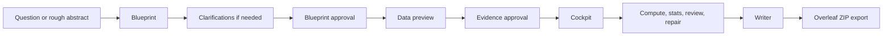

<div align="center">

# Thrivarc

### Research cockpit for empirical finance

From question to Blueprint to evidence preview to live analysis to Overleaf export.

[Open the product](https://app.thrivarc.studio) · [Start a study](https://app.thrivarc.studio/app.html#new)

</div>

---

## What Thrivarc is

Thrivarc is a researcher-controlled operating room for empirical finance. A user can begin with only a topic, a rough abstract, a directional hypothesis, or a dataset. Thrivarc then:

1. shapes the idea into a formal Blueprint
2. blocks compute until the exact evidence is previewed and approved
3. runs the study through a gated multi-agent pipeline
4. streams artifacts, logs, prompts, and compute outputs live
5. lets the researcher intervene with approvals, follow-up instructions, prompt amplifiers, and notebook-style compute cells
6. exports an Overleaf-ready ZIP with LaTeX, figures, tables, logs, prompts, and provenance

This is not a one-shot paper writer and not a generic chat wrapper. The product is built so the researcher can always answer:

1. What question is actually being tested?
2. What data is being used?
3. What code ran?
4. What outputs were produced?
5. What objections were raised?
6. What exactly went into the exported paper package?

## Why it exists

Most research workflows fail in quiet ways. The question changes after the data is seen. The benchmark drifts. The evidence route gets fuzzier over time. Compute produces outputs the writer then turns into authoritative prose that nobody can fully trace.

Thrivarc is designed to reverse that pattern:

1. Blueprint before compute
2. evidence preview before launch
3. live approvals before phase transitions
4. reviewer pressure before paper writing
5. provenance packaged with the final export

## The product experience

### New study

The user enters:

1. a topic
2. a rough abstract
3. a hypothesis
4. or a dataset note

Thrivarc then infers:

1. research stance
2. likely method family
3. likely evidence route
4. what still needs clarification

### Blueprint

Thrivarc generates a formal study plan and asks the researcher to approve it before anything expensive begins.

### Evidence preview

Thrivarc previews the exact dataset, schema, identifiers, date range, warnings, and fingerprint. The run cannot start until the researcher approves the evidence.

### Cockpit

After launch, the researcher enters a live cockpit with:

1. phase timeline and approvals
2. artifact gallery
3. live logs
4. prompt amplifiers
5. model settings
6. notebook-style compute cells
7. paper quality checks
8. Overleaf export

### Export

Thrivarc produces an Overleaf-ready ZIP containing:

1. `final.tex`
2. bibliography when available
3. figures
4. result tables and CSVs
5. generated code outputs
6. prompt manifest
7. run manifest
8. quality report
9. README

## Researcher flow

### If the researcher has only a topic

Example:

`Does a rising VIX predict next-week negative SPY returns?`

Flow:

1. open `app.html#new`
2. paste the question
3. click `Build Blueprint`
4. answer any targeted clarification
5. approve the Blueprint
6. preview the evidence
7. approve the dataset
8. enter the cockpit
9. inspect outputs, approve gates, add instructions or cells, and export

### If the researcher has a rough abstract

The abstract can go directly into the main intake box and optional context fields. Thrivarc extracts the claim, mechanism, likely data route, and validation burden from that material.

### If the researcher has their own dataset

The researcher selects `Upload dataset` or `Stage source`, attaches the file, builds the Blueprint, and then reviews the schema preview before compute is allowed to begin.

## What the cockpit contains

### Left rail

1. current phase
2. approval gates
3. sandbox job status
4. autopilot state

### Center workspace

1. live artifacts
2. figures
3. tables
4. notebook-style compute cells
5. export panel

### Right inspector

1. follow-up instruction box
2. queued follow-ups
3. Prompt Studio
4. model selector by phase
5. quality report

## Trust architecture

The product is built around a small number of hard rules:

| Rule | Why it matters |
|---|---|
| PostgreSQL is the only durable state source | Session truth lives in one canonical place |
| Azure Blob is the only durable artifact source | Files, figures, tables, logs, and papers stay traceable |
| SSE is the live update channel | The UI reflects backend truth rather than browser invention |
| Generated compute runs in Modal in production | Analysis code is isolated from the API container |
| Writer is last | The paper cannot become the source of truth |
| Prompt amplifiers are versioned | Researcher intervention remains inspectable |
| Evidence must be previewed before launch | No silent data swaps or hidden compute |

## Core workflow model


```mermaid
flowchart LR
    A["Question or rough abstract"] --> B["Blueprint"]
    B --> C["Clarifications if needed"]
    C --> D["Blueprint approval"]
    D --> E["Data preview"]
    E --> F["Evidence approval"]
    F --> G["Cockpit"]
    G --> H["Compute, stats, review, repair"]
    H --> I["Writer"]
    I --> J["Overleaf ZIP export"]
```

## Product surface area

### Public routes

1. `/`
2. `/index.html`
3. `/app`
4. `/app.html`
5. `/health`
6. `/ready`

### App routes

1. `#dashboard`
2. `#new`
3. `#guide`
4. `#research/{session_id}`

### API surface

The canonical workflow lives under `/api/sessions/*`, with supporting routes for guide building and data preview:

1. `/api/guide/*`
2. `/api/data/*`
3. `/api/sessions/*`

Important session endpoints include:

1. session creation and list
2. Blueprint state
3. cockpit payload
4. approvals
5. follow-ups
6. prompt amplifiers
7. composed prompts
8. model settings
9. compute cells
10. quality report
11. artifact listing and download
12. Overleaf ZIP export
13. session SSE stream

## Architecture

### Frontend

Static HTML app served by FastAPI. The app uses hash routing and relies on backend state plus SSE updates rather than inventing truth client-side.

### Backend

FastAPI orchestrates:

1. session creation
2. Blueprint persistence
3. approval gates
4. follow-up classification
5. prompt composition
6. quality checks
7. export packaging

### Compute

The API prepares the analysis request, the LLM writes or repairs study-specific code, and Modal executes the compute workload in an isolated environment. Returned outputs are uploaded to Azure Blob and attached to the session record.

### Storage

1. PostgreSQL stores session and cockpit state
2. Azure Blob stores artifacts

## Security and secret handling

Secrets do not belong in git.

Production secrets should live in Azure Container App secrets and environment variables, not in tracked files. This includes:

1. `OPENAI_API_KEY`
2. `OPENAI_API_KEY_PASS2`
3. `DATABASE_URL`
4. `AZURE_STORAGE_CONNECTION_STRING`
5. `MODAL_*TOKEN*`
6. `FRED_API_KEY`
7. any admin password or private provider credential

Local development can use a gitignored `.env`, but production must source credentials from Azure-managed configuration.

## Tech stack

| Layer | Current stack |
|---|---|
| Web/API | FastAPI |
| Frontend | static HTML, CSS, JS |
| Durable state | PostgreSQL |
| Durable artifacts | Azure Blob Storage |
| Live updates | Server-Sent Events |
| LLM | Azure OpenAI `gpt-4o` |
| Production compute | Modal |
| Deployment | Azure Container Apps |
| Document export | LaTeX + Overleaf ZIP |

## Local development

### 1. Clone and install

```bash
git clone https://github.com/gouravsalottra/paper-forge-private.git
cd paper-forge-private
python -m venv .venv
source .venv/bin/activate
pip install -r requirements.txt
```

### 2. Configure environment

```bash
cp .env.example .env
```

Use local values in `.env` only for development. Do not commit it.

### 3. Run the app

```bash
uvicorn main:app --reload
```

Open:

1. `http://127.0.0.1:8000/index.html`
2. `http://127.0.0.1:8000/app.html#new`

### 4. Run tests

```bash
pytest -q
```

## Environment configuration

The repo includes `.env.example` as a shape reference only. Use plain placeholders in git-tracked files and real values only in:

1. local gitignored `.env` for development
2. Azure Container App secrets / env vars for production

Example shape:

```bash
OPENAI_API_KEY=your_openai_api_key_here
OPENAI_API_KEY_PASS2=your_optional_second_openai_api_key_here
PAPER_FORGE_MINER_SOURCE=yfinance
WRDS_USERNAME=your_wrds_username
FRED_API_KEY=
THRIVARC_COMPUTE_BACKEND=modal
MODAL_ACCOUNT_ALIAS=primary
MODAL_ROUTER_ENABLED=1
MODAL_ACCOUNT_ALIASES=primary,secondary,tertiary
MODAL_MONTHLY_BUDGET_USD=28
MODAL_APP_NAME=thrivarc-compute
MODAL_FUNCTION_NAME=run_analysis_code
```

## Repository guide

| Path | Purpose |
|---|---|
| `frontend/` | landing page and app shell |
| `api/` | session orchestration, guide, compute dispatch, writing, export |
| `agents/` | legacy and supporting agent implementations |
| `db/` | database connection and migrations |
| `storage/` | blob storage adapters |
| `integrity/` | PDF rendering, DataPassport, preregistration, deviation tools |
| `tests/` | unit, integration, flow, and regression coverage |

## What makes Thrivarc different

Most AI research tools stop at “generate a report.” Thrivarc is designed around the full research lifecycle:

1. shaping the question
2. locking the design
3. inspecting the evidence
4. running the analysis
5. pressuring the study with review and repair
6. exporting a package the researcher can actually continue

The real product is not the text output. The real product is controlled, inspectable research motion.

## Current status

Thrivarc is an active private system evolving from a pipeline into a full research cockpit. The live product already supports:

1. new-study intake
2. Blueprint approval
3. evidence preview
4. cockpit approvals
5. live artifacts
6. prompt amplifiers
7. notebook-style compute cells
8. paper quality checks
9. Overleaf ZIP export

## Contributing

Before changing product behavior:

1. keep PostgreSQL as the only durable state source
2. keep Azure Blob as the only durable artifact source
3. avoid reintroducing secrets into tracked files
4. preserve the evidence-before-compute rule
5. preserve the writer-last rule

Run tests before shipping:

```bash
pytest -q
```

## License

MIT. See [LICENSE](LICENSE).

