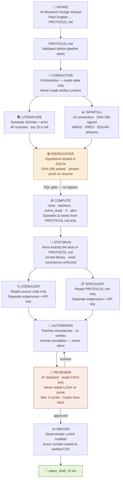
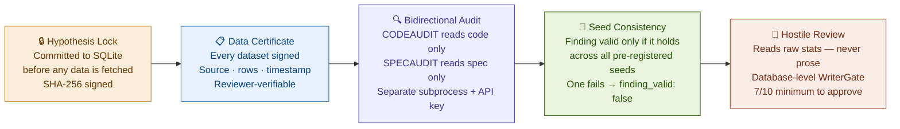
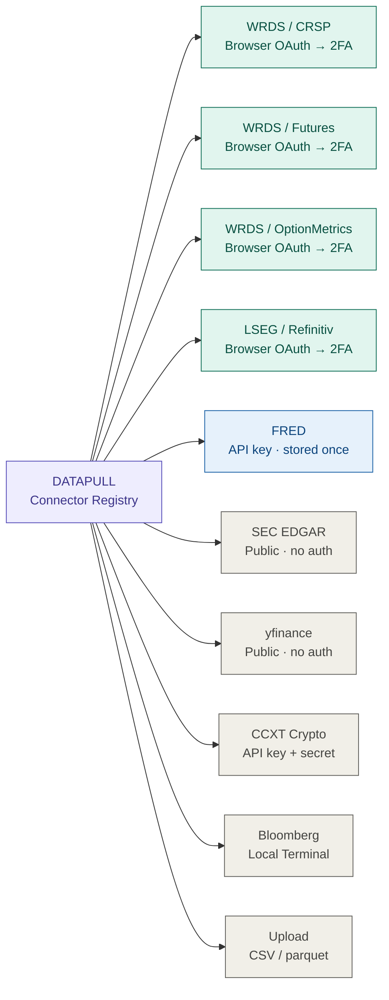
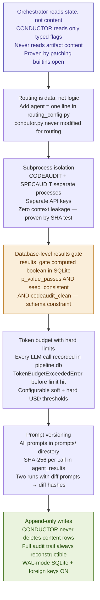

<div align="center">

```
██████╗  █████╗ ██████╗ ███████╗██████╗       ███████╗ ██████╗ ██████╗  ██████╗ ███████╗
██╔══██╗██╔══██╗██╔══██╗██╔════╝██╔══██╗      ██╔════╝██╔═══██╗██╔══██╗██╔════╝ ██╔════╝
██████╔╝███████║██████╔╝█████╗  ██████╔╝█████╗█████╗  ██║   ██║██████╔╝██║  ███╗█████╗
██╔═══╝ ██╔══██║██╔═══╝ ██╔══╝  ██╔══██╗╚════╝██╔══╝  ██║   ██║██╔══██╗██║   ██║██╔══╝
██║     ██║  ██║██║     ███████╗██║  ██║      ██║     ╚██████╔╝██║  ██║╚██████╔╝███████╗
╚═╝     ╚═╝  ╚═╝╚═╝     ╚══════╝╚═╝  ╚═╝      ╚═╝      ╚═════╝ ╚═╝  ╚═╝ ╚═════╝ ╚══════╝
```

### The autonomous finance research pipeline.
### From idea to peer-review-ready paper — for **any** empirical finance question.
### Scientific integrity enforced by architecture, not by trust.

<br/>

[](https://github.com/gouravsalottra/paper-forge-private/actions/workflows/ci.yml)


</div>

---

## What Is Paper-Forge?

Paper-Forge is an **autonomous 11-agent research pipeline** for empirical finance. It takes a research idea and produces a fully auditable, reproducible, peer-review-ready paper — with every integrity guarantee enforced by the system, not by researcher discipline.

It works for **any empirical finance research question**. LLM sentiment analysis, momentum strategies, climate risk pricing, systemic risk networks, ETF arbitrage, cryptocurrency session effects — any question with data and a testable claim.

> **The core insight:** Most research integrity failures are not caused by dishonest researchers. They are caused by systems that allow unconscious hypothesis adjustment after seeing results. Paper-Forge makes that adjustment architecturally impossible.

---

## The Problem

Finance research has a replication crisis. Studies estimate more than half of published factor discoveries do not replicate. The cause is rarely fraud — it is a workflow problem.

| Traditional workflow | Paper-Forge workflow |
|---|---|
| 1. Collect data | 1. Describe idea to INTAKE |
| 2. Explore what looks significant | 2. INTAKE generates PROTOCOL.md |
| 3. **Form hypothesis around result** ← the problem | 3. **Hypothesis locked in SQLite before data is touched** |
| 4. Run "confirmatory" tests | 4. Tests run exactly as pre-specified |
| 5. Write paper around significance | 5. Code audited against paper claims |
| 6. Submit | 6. Hostile review before any prose is written |

---

## Full Pipeline Architecture


```mermaid
flowchart TD
    A["🧠 INTAKE\nAI Research Design Wizard\nPlain English → PROTOCOL.md"] --> B[PROTOCOL.md\nValidated before pipeline starts]
    B --> C["⚡ CONDUCTOR\nOrchestrator — reads state only\nNever reads artifact content"]

    C --> D["📚 LITERATURE\nSemantic Scholar + arXiv\n40 scanned · top 10 in full"]
    C --> E["📊 DATAPULL\n10 connectors · SHA-256 signed\nWRDS · FRED · EDGAR · yfinance"]

    D --> F
    E --> F

    F["🔒 PREREGISTER\nHypothesis locked in SQLite\nSHA-256 sealed · tamper-proof on resume"]

    F -->|"SQL gate — no bypass"| G["⚙️ COMPUTE\nnone · backtest · event_study · rl · abm\nEpisodes & seeds from PROTOCOL.md only"]

    G --> H["📐 STATSRUN\nRuns exactly the tests in PROTOCOL.md\n14-test library · seed consistency enforced"]

    H --> I["🔍 CODEAUDIT\nReads source code only\nSeparate subprocess + API key"]
    H --> J["📋 SPECAUDIT\nReads PROTOCOL.md only\nSeparate subprocess + API key"]

    I --> K
    J --> K

    K["🔧 AUTOREPAIR\nPatches mismatches · re-verifies\nHuman escalation — never silent"]

    K --> L["🦅 REVIEWER\nJF standard · reads CSVs only\nNever reads LaTeX or prose\nMax 3 cycles · routes fixes back"]

    L -->|"approved"| M["✍️ WRITER\nDeterministic LaTeX scaffold\nEvery number traced to verified CSV"]
    L -->|"revision"| K

    M --> N["✅ paper_draft_v2.tex"]

    style F fill:#faeeda,stroke:#BA7517,color:#633806
    style L fill:#faece7,stroke:#993C1D,color:#712B13
    style N fill:#EAF3DE,stroke:#3B6D11,color:#27500A
```

> **Note:** LITERATURE and DATAPULL run in parallel. The SQL gate at PREREGISTER is a database constraint — Python cannot bypass it.

---

## Five Integrity Layers


```mermaid
graph LR
    A["🔒 Hypothesis Lock\nCommitted to SQLite\nbefore any data is fetched\nSHA-256 signed"] --> B["📋 Data Certificate\nEvery dataset signed\nSource · rows · timestamp\nReviewer-verifiable"]
    B --> C["🔍 Bidirectional Audit\nCODEAUDIT reads code only\nSPECAUDIT reads spec only\nSeparate subprocess + API key"]
    C --> D["🌱 Seed Consistency\nFinding valid only if it holds\nacross all pre-registered seeds\nOne fails → finding_valid: false"]
    D --> E["🦅 Hostile Review\nReads raw stats — never prose\nDatabase-level WriterGate\n7/10 minimum to approve"]

    style A fill:#faeeda,stroke:#BA7517,color:#633806
    style B fill:#E6F1FB,stroke:#185FA5,color:#0C447C
    style C fill:#EEEDFE,stroke:#534AB7,color:#3C3489
    style D fill:#EAF3DE,stroke:#3B6D11,color:#27500A
    style E fill:#faece7,stroke:#993C1D,color:#712B13
```

---

## Two Research Modes

### Confirmatory — you have a hypothesis

```
$ python intake.py

INTAKE: Tell me about your research idea.

You: Does conditioning sector ETF momentum on VIX term structure
     inversion reduce crashes while preserving upside?

INTAKE: Here is the hypothesis I'll pre-register. Once committed
        this cannot change without starting a new run:

        "Conditioning 12-1 month sector ETF momentum on VIX term
         structure inversion reduces maximum drawdown by at least
         15% during crash events while preserving 80% of Sharpe."

        Type 'commit' to lock, or 'edit' to modify.

You: commit

🔒 Hypothesis locked. SHA-256: 7f3a91c4...
   PROTOCOL.md sealed. Pipeline starting.
```

### Exploratory — you don't have a hypothesis yet

Paper-Forge supports this honestly — exploration is logged separately and transparently disclosed in the paper.

```
$ python intake.py

INTAKE: Tell me about your research idea.

You: I've noticed something in how energy ETFs respond overnight
     around climate policy announcements but I don't know what
     direction or magnitude to expect.

INTAKE: This is exploratory research. I'll set up an exploratory
        run. Your analysis will be logged separately.

        After you see the patterns, I'll help you form a hypothesis
        and upgrade to a confirmatory run — with the exploration
        disclosed in your methods section as required.
```

When ready:

```
$ python intake.py --upgrade-to-confirmatory --run-id explore-20260509

INTAKE: Your exploration found:
        ICLN overnight: +0.18% on COP dates (n=23)
        XLE overnight:  -0.31% on the same dates
        Spread strengthened post-2018

        Here are three hypotheses you could pre-register.
        Which is most honest given what you saw?
```

---

## Data Sources


```mermaid
graph LR
    PF["DATAPULL\nConnector Registry"]

    PF --> W1["WRDS / CRSP\nBrowser OAuth → 2FA"]
    PF --> W2["WRDS / Futures\nBrowser OAuth → 2FA"]
    PF --> W3["WRDS / OptionMetrics\nBrowser OAuth → 2FA"]
    PF --> L["LSEG / Refinitiv\nBrowser OAuth → 2FA"]
    PF --> F["FRED\nAPI key · stored once"]
    PF --> SE["SEC EDGAR\nPublic · no auth"]
    PF --> YF["yfinance\nPublic · no auth"]
    PF --> C["CCXT Crypto\nAPI key + secret"]
    PF --> B["Bloomberg\nLocal Terminal"]
    PF --> U["Upload\nCSV / parquet"]

    style PF fill:#EEEDFE,stroke:#534AB7,color:#3C3489
    style W1 fill:#E1F5EE,stroke:#0F6E56,color:#085041
    style W2 fill:#E1F5EE,stroke:#0F6E56,color:#085041
    style W3 fill:#E1F5EE,stroke:#0F6E56,color:#085041
    style L fill:#E1F5EE,stroke:#0F6E56,color:#085041
    style F fill:#E6F1FB,stroke:#185FA5,color:#0C447C
    style SE fill:#F1EFE8,stroke:#5F5E5A,color:#444441
    style YF fill:#F1EFE8,stroke:#5F5E5A,color:#444441
    style C fill:#F1EFE8,stroke:#5F5E5A,color:#444441
    style B fill:#F1EFE8,stroke:#5F5E5A,color:#444441
    style U fill:#F1EFE8,stroke:#5F5E5A,color:#444441
```

Authenticate once per provider. Credentials stored securely. Every run fetches automatically after first auth.

Adding a new connector: one file in `agents/datapull/connectors/`.

---

## Statistical Test Library

STATSRUN runs **exactly the tests PROTOCOL.md specifies** — no hardcoded battery. Adding a new test: one file in `agents/statsrun/tests/`.

| Test | Suited for |
|---|---|
| `newey_west_hac` | Predictability, performance — t-test with autocorrelation correction |
| `garch_11` | Any — volatility modeling and persistence |
| `bootstrap_ci` | Any — non-parametric confidence intervals |
| `deflated_sharpe` | Performance — Sharpe corrected for multiple testing |
| `fama_macbeth` | Predictability, performance — two-pass cross-sectional |
| `regime_switching` | Any — structural break detection |
| `markov_switching` | Any — hidden state regime identification |
| `event_study_car` | Causal — cumulative abnormal returns |
| `placebo_test` | Predictability, causal — false discovery validation |
| `out_of_sample_r2` | Predictability — genuine predictive power |
| `granger_causality` | Causal — temporal precedence |
| `panel_regression` | Any — fixed/random effects with clustering |
| `descriptive_stats` | Exploratory — summary statistics |
| `circular_stats` | Crypto, intraday — time-of-day effects |

INTAKE recommends defaults by claim type:

```
predictability → fama_macbeth, out_of_sample_r2, placebo_test, newey_west_hac
performance    → newey_west_hac, deflated_sharpe, bootstrap_ci, regime_switching
causal         → event_study_car, placebo_test, newey_west_hac, granger_causality
exploratory    → descriptive_stats, regime_switching, markov_switching
```

---

## Quick Start

```bash
git clone https://github.com/gouravsalottra/paper-forge-private
cd paper-forge-private

python -m venv .venv && source .venv/bin/activate
pip install -r requirements.lock      # fully pinned — identical environment guaranteed

cp .env.example .env                  # add your OPENAI_API_KEY
```

**New research (recommended):**
```bash
python intake.py
# Guides you in plain English, handles data auth, generates PROTOCOL.md
python run_pipeline.py
```

**Dev mode (no institutional data):**
```bash
export PAPER_FORGE_MINER_SOURCE=yfinance
python run_pipeline.py
```

**Resume a halted run:**
```bash
python run_pipeline.py --resume pf-live-20260422 --from CODEAUDIT
# Hypothesis lock preserved and re-verified on resume
```

**Run tests:**
```bash
pytest -q
# 129 passed, 1 skipped in 20.02s
```

---

## Run Dashboard

```
$ python dashboard.py

RUN ID                    STATUS   STARTED           PHASES   COST
pf-live-20260423-203428   DONE     2026-04-23 20:34   9/9     $3.42
pf-live-20260423-185058   DONE     2026-04-23 18:50   9/9     $3.18
pf-live-20260423-040430   DONE     2026-04-23 04:04   9/9     $2.97

$ python dashboard.py --run-id pf-live-20260423-203428

Phase           Status   Duration    Cost     Notes
LITERATURE      done     4m 23s      $0.40    40 papers, 9 full reads
DATAPULL        done     2m 11s      —        WRDS + FRED, SHA-256 certified
PREREGISTER     done     0m 12s      $0.15    Hypothesis locked: 7f3a91c4...
COMPUTE         done     —           —        type: backtest, 3 seeds
STATSRUN        done     3m 44s      —        5 tests, finding_valid: true
CODEAUDIT       done     8m 22s      $1.12    1 mismatch → AUTOREPAIR patched
REVIEWER        done     6m 30s      $0.95    Approved cycle 2, score 8.1/10
WRITER          done     12m 10s     $0.80    paper_draft_v2.tex

Total: $3.42  │  Artifacts: runs/pf-live-20260423-203428/
```

---

## What Honest Failure Looks Like

Most tools surface the favorable result. Paper-Forge surfaces everything.

```json
{
  "consistent": false,
  "finding_valid": false,
  "conclusion": "Finding does NOT hold across all 3 seeds — invalid per PROTOCOL.md",
  "seed_1337": { "direction": "negative", "significant": true },
  "seed_42":   { "direction": "positive", "significant": false },
  "seed_9999": { "direction": "negative", "significant": false }
}
```

The pipeline reports this. The paper reports this. **A null result is a valid output.** The system is designed to report failures, not manufacture significance.

---

## System Design Principles

**For engineers and architects.**


```mermaid
graph TD
    A["Orchestrator reads state, not content\nCONDUCTOR reads only typed flags\nNever reads artifact content\nProven by patching builtins.open"] --> B["Routing is data, not logic\nAdd agent = one line in routing_config.py\ncondutor.py never modified for routing"]

    B --> C["Subprocess isolation\nCODEAUDIT + SPECAUDIT separate processes\nSeparate API keys\nZero context leakage — proven by SHA test"]

    C --> D["Database-level results gate\nresults_gate computed boolean in SQLite\np_value_passes AND seed_consistent\nAND codeaudit_clean — schema constraint"]

    D --> E["Token budget with hard limits\nEvery LLM call recorded in pipeline.db\nTokenBudgetExceededError before limit hit\nConfigurable soft + hard USD thresholds"]

    E --> F["Prompt versioning\nAll prompts in prompts/ directory\nSHA-256 per call in agent_results\nTwo runs with diff prompts → diff hashes"]

    F --> G["Append-only writes\nCONDUCTOR never deletes content rows\nFull audit trail always reconstructible\nWAL-mode SQLite + foreign keys ON"]

    style A fill:#EEEDFE,stroke:#534AB7,color:#3C3489
    style D fill:#faeeda,stroke:#BA7517,color:#633806
    style G fill:#EAF3DE,stroke:#3B6D11,color:#27500A
```

---

## Extending Paper-Forge

Adding a **data source** — one file:
```python
# agents/datapull/connectors/my_source.py
from agents.datapull.connectors.registry import register

@register
class MySourceConnector:
    source_name = "my_source"
    def fetch(self, dataset, fields, date_range, filters, output_dir):
        # return (dataframe, certificate_dict)
```

Adding a **statistical test** — one file:
```python
# agents/statsrun/tests/my_test.py
from agents.statsrun.tests.registry import register

@register
class MyTest:
    test_name = "my_test"
    def run(self, data, seed, params):
        # return dict with p_value, statistic, significant, effect_size
```

Adding a **compute adapter** — one file:
```python
# agents/compute/adapters/my_adapter.py
from agents.compute.adapters.registry import register

@register
class MyAdapter:
    adapter_type = "my_compute"
    def run(self, params, output_dir, seeds):
        # return results dict
```

Adding a **new agent** — one line:
```python
# agents/conductor/routing_config.py
AGENT_SERVER_MAP = {
    ...
    "MY_AGENT": "my_server",   # ← that's it
}
```

---

## What Gets Produced Per Run

```
runs/pf-live-YYYYMMDD-HHMMSS/
├── literature_map.md           ← gap analysis, citation seeds
├── data_certificate.json       ← SHA-256 signed data lineage
├── hypothesis_lock.json        ← pre-registered hypothesis + hash
├── stats_tables/
│   ├── seed_consistency.csv    ← READ THIS FIRST: finding_valid true/false
│   ├── primary_metric.csv      ← your primary result
│   ├── ttest_results.csv       ← p-values and effect sizes
│   └── library_versions.json   ← exact versions for replication
├── codeaudit_spec.md           ← what the code actually implements
├── specaudit_report.md         ← what PROTOCOL.md claimed
├── codec_mismatch.md           ← where they diverged
├── autorepair_report.md        ← fixes applied + human escalations
├── reviewer_report_v1.md       ← full referee report
├── reviewer_scores_v1.json     ← methodology rubric scores 1-10
├── paper_draft_v1.tex          ← initial scaffold — never overwritten
├── paper_draft_v2.tex          ← after REVIEWER revision
└── pipeline.log                ← structured JSON log every agent event
```

---

## Environment Variables

```bash
OPENAI_API_KEY=sk-...                    # required
OPENAI_API_KEY_PASS2=sk-...             # separate key for SPECAUDIT
PAPER_FORGE_MINER_SOURCE=yfinance       # wrds (production) or yfinance (dev)
WRDS_USERNAME=your_wrds_username
PAPERFORGE_SOFT_LIMIT_USD=10.0          # token budget soft warning
PAPERFORGE_HARD_LIMIT_USD=25.0          # token budget hard stop
PAPERFORGE_OVERRIDE_PAP_TAMPER=1        # expert use — logged as CRITICAL
```

---

## MCP Servers

Three functional MCP servers expose pipeline capabilities as tools:

```
mcp_servers/arxiv_server.py   → search_arxiv, fetch_arxiv_paper
mcp_servers/latex_server.py   → compile_latex, validate_latex_syntax
mcp_servers/modal_server.py   → dispatch_compute_job, check_compute_status
```

---

## Examples

`examples/gsci_momentum/` — the first paper produced by Paper-Forge. A study of passive investor concentration effects on commodity futures momentum profitability. Shows what a complete PROTOCOL.md looks like for a performance claim, how to design a custom RL environment, and what a full pipeline run produces.

Reference material only — not maintained as runnable code.

---

## Known Limitations

**WRITER produces a scaffold, not a finished paper.** Introduction, related work, discussion, and conclusion require human authorship. WRITER produces methodology, results, and tables — the sections that must be grounded in verified data.

**COMPUTE adapters for backtest and event_study are scaffolded.** Interface defined and tested. Implementation needs to be built per research design. See `examples/gsci_momentum/compute/` for a complete RL reference.

**WRDS requires institutional access.** Use `PAPER_FORGE_MINER_SOURCE=yfinance` for development.

---

## Contributing

| Area | File | What's needed |
|---|---|---|
| New data connector | `agents/datapull/connectors/` | Any institutional data source |
| New statistical test | `agents/statsrun/tests/` | Any test not in the library |
| Backtest adapter | `agents/compute/adapters/backtest_adapter.py` | Full strategy engine |
| Event study adapter | `agents/compute/adapters/event_study_adapter.py` | CAR computation |
| New research domain | Run `python intake.py` | All integrity infrastructure carries over |

Before any PR: `pytest -q` must show 0 failures.

---

## License

MIT — see [LICENSE](LICENSE)

---

<div align="center">

REVIEWER models Journal of Finance · Review of Financial Studies · Journal of Financial Economics standards

Pre-registration inspired by OSF Pre-registration and AEA RCT Registry

Multiple testing correction: Harvey, Liu & Zhu (2016)

<br/>

*Built by [Gourav Salottra](https://github.com/gouravsalottra) · Boston University*

</div>
